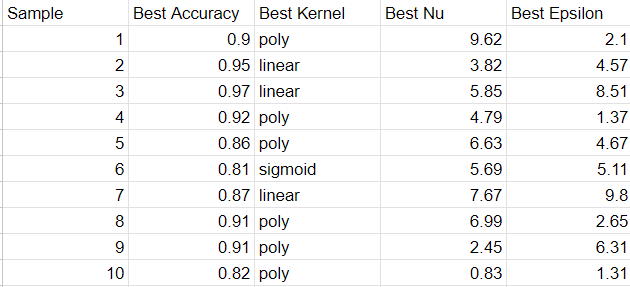
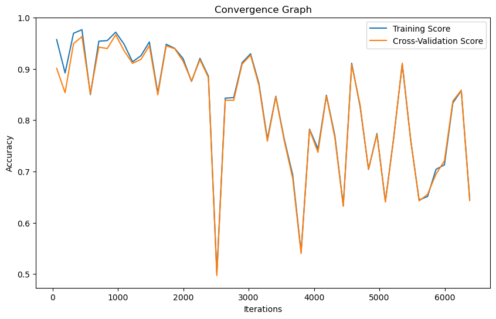

# Dataset Analysis Report

## Overview

Dataset: [Room Occupancy](https://archive.ics.uci.edu/ml/datasets/Room+Occupancy+Estimation)

This dataset is used for estimating the precise number of occupants in a room using multiple non-intrusive environmental sensors like temperature, light, sound, CO2 and PIR. It is a multi-variate classification Dataset.

## Result Graph

